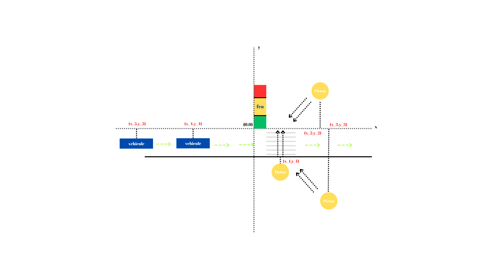

Ces équations nous permettent de modéliser mathématiquement des situations comme la vitesse des véhicules, le mouvement des piétons, l'arrêt ou le ralentissement des véhicules aux feux de circulation.

Serdar VAROL
HAZEM
LYDIA

# Système de Simulation du Trafic

## 1. Mouvement des Voitures

Les voitures se déplacent de droite à gauche, avec des dynamiques d'accélération et de décélération. Nous modéliserons leur mouvement en fonction de la vitesse et de l'accélération.

### a) **Accélération des Voitures**
Si une voiture démarre à l'arrêt et atteint une limite de vitesse (par exemple, 50 km/h), l'accélération est donnée par l'équation suivante :

- **Équation de la vitesse :**
  $$
  v_c(t) = v_0 + a \cdot t
  $$
  Où :
   - \( $v_0$ \)  est la vitesse initiale (par exemple, \( $v_0 = 0$ \)),
   - \( $a$ \) est l'accélération.

### b) **Vitesse Limite**
Lorsque la voiture atteint une limite de vitesse (par exemple \( $ v_{\text{max}} = 50 \, \text{km/h}$ \)), elle continue à une vitesse constante :
\[
$v_c(t) = v_{\text{max}} = 50 \, \text{km/h}$
\]

### c) **Décélération et Arrêt**
Si une voiture ralentit lorsqu'elle approche d'un feu rouge, une décélération (accélération négative) est appliquée. Lorsque la voiture atteint une distance \( $d_s$ \) du feu, elle doit s'arrêter :

- **Équation de la décélération :**

  $$v_c(t) = v_{\text{max}} + (-a_{\text{slow}}) \cdot t$$

  Où \( $a_{\text{slow}} $\) est la décélération.

- **Condition d'arrêt :**
  $$
  \text{Si } x_c(t) \leq x_L + d_s \text{ et } L(t) = 0 \text{ alors } v_c(t) = 0
  $$
  Où \( $x_L$ \) est la position du feu, et \( $d_s$ \) est la distance de sécurité d'arrêt.

### d) **Position de la Voiture**
La position d'une voiture est calculée en fonction de la vitesse et de l'accélération :

- **Équation de mouvement (avec accélération) :**
  $$
  x_c(t) = x_0 + v_0 \cdot t + \frac{1}{2} a \cdot t^2
  $$
  Où :
   - \( $x_0$ \) est la position initiale,
   - \( $v_0$ \) est la vitesse initiale,
   - \( $a$ \) est l'accélération.

---

## 2. Dynamique des Feux de Signalisation

Les feux de signalisation fonctionnent en cycles (vert, jaune, rouge). La dynamique des feux est modélisée par une fonction en fonction du temps \( $t$ \).

### a) **Fonction des Feux de Signalisation**
La fonction suivante décrit l'état des feux en fonction du temps :

- **Équation des feux de signalisation \( $L(t)$ \) :**
  $$
  L(t) =
  \begin{cases}
  1, & 0 \leq t \mod T < T_g \\  
  0.5, & T_g \leq t \mod T < T_g + T_y \\
  0, & T_g + T_y \leq t \mod T < T_g + T_y + T_r
  \end{cases}
  $$

Si $T_g = 30 sn $ donc la duree de vert 30 second Total T = 60
    
$T_y = 5 sn $
     
$T_r = 25 sn$

$T = 60 sn$

  example: $ (t=10 \mod 60) = 10 < T_g $ 

  Où :
   - \( $T_g$ \) est la durée du feu vert,
   - \( $T_y$ \) est la durée du feu jaune,
   - \( $T_r$ \) est la durée du feu rouge,
   - \( $T = T_g + T_y + T_r$ \) est la durée totale du cycle.

### b) **États des Feux**
- **Pour feu vert :** \( $L(t) = 1$ \),
- **Pour feu jaune :** \( $L(t) = 0.5$ \),
- **Pour feu rouge :** \( $L(t) = 0$ \).

---

## 3. Mouvement des Piétons

Les piétons attendent que le feu devienne vert pour traverser la rue. Ce mouvement est modélisé par une fonction.

### a) **Équation du Mouvement des Piétons**
Un piéton reste immobile tant que le feu est rouge, puis commence à se déplacer lorsque le feu devient vert.

- **Mouvement du piéton \( $x_p(t)$ \) :**
  $$
  x_p(t) =
  \begin{cases}
  x_{p0}, & L(t) = 0 \text{ (feu rouge ou jaune)} \\
  x_{p0} - v_p \cdot (t - t_g), & L(t) = 1 \text{ (feu vert)}
  \end{cases}
  $$
  Où :
   - \( $x_{p0}$ \) est la position initiale du piéton,
   - \( $v_p$ \) est la vitesse du piéton,
   - \( $t_g$ \) est le temps auquel le feu devient vert.

### b) **Conditions de Mouvement et d'Arrêt des Piétons**
- Lorsque le feu est rouge ou jaune : \( $L(t) = 0 \text{ ou } 0.5 $\), le piéton reste immobile : \( $x_p(t) = x_{p0} $\),
- Lorsque le feu est vert : \( $L(t) = 1 $\), le piéton se déplace : \( $x_p(t) = x_{p0} - v_p \cdot (t - t_g) $\).

---

Résumé :

    Voitures : Modélisées par des équations d'accélération, de mouvement à vitesse constante, de décélération et d'arrêt.
    Feu de circulation : Exprimé par une fonction qui change avec le temps (vert, jaune, rouge).
    Piétons : Agissent ou attendent en fonction de l'état du feu

Wilensky, U. (1998). NetLogo Traffic Intersection model. http://ccl.northwestern.edu/netlogo/models/TrafficIntersection. Center for Connected Learning and Computer-Based Modeling, Northwestern University, Evanston, IL.