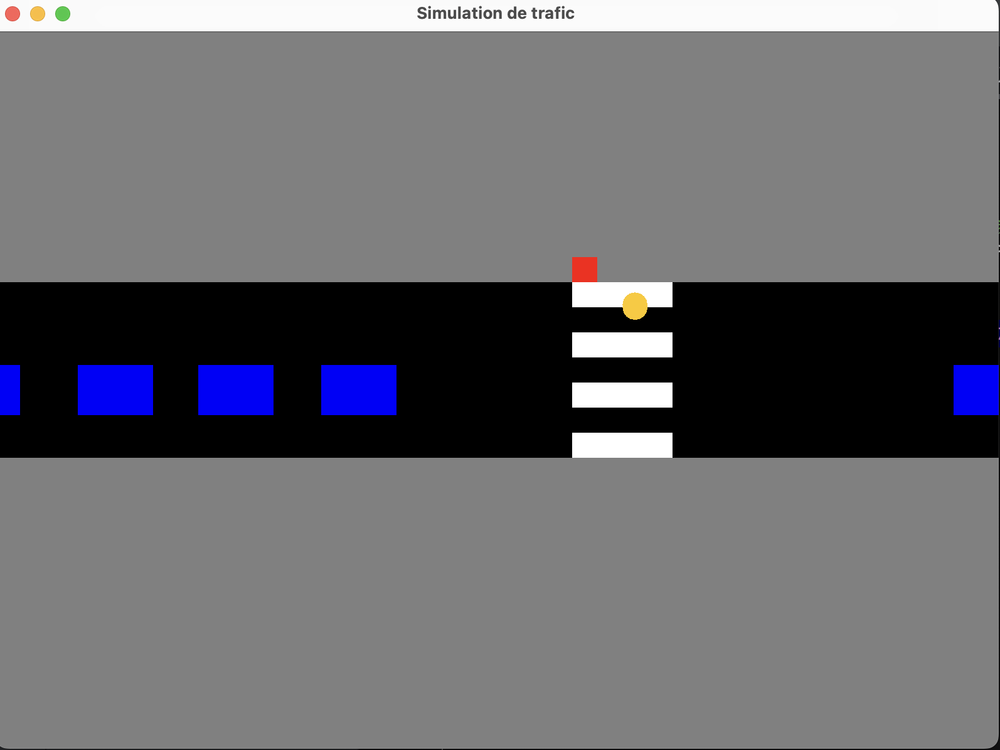

# SimulationPanel 

Ce panneau de simulation est une application Java Swing qui modélise graphiquement le mouvement des véhicules et des piétons à un carrefour. La classe `SimulationPanel` crée un environnement de simulation en utilisant des objets `Vehicules`, `Pietons`, et un feu de circulation (`Feu`)(creé par Hazem IBNMTAR).

### Structure et Fonctionnement
- **Plan et Représentation Graphique** : La simulation repose sur un fichier de plan nommé "plan.csv"(creé par Lydia MOUTCHACHOU), qui contient une carte lue dans un tableau 2D. Cette carte est représentée graphiquement avec différents éléments : trottoirs, routes, passages piétons et feux de circulation. Chaque cellule de la carte est dessinée avec des couleurs spécifiques : gris pour les trottoirs, noir pour les routes, blanc pour les passages piétons, et les feux de circulation sont colorés en fonction de leur état (vert, jaune ou rouge).

- **Véhicules et Piétons** : Au début de la simulation, cinq véhicules sont ajoutés et positionnés sur l'axe X, tandis que trois piétons sont placés sur l'axe Y. Ces objets sont créés dynamiquement et assignés à un thread pour les faire fonctionner de manière simultanée. Les véhicules avancent sur la route tant que le feu est vert, mais s'arrêtent lorsqu'il devient rouge. Les piétons, quant à eux, avancent uniquement lorsque le feu est rouge pour les véhicules, ce qui leur permet de traverser en toute sécurité.

- **Gestion des Threads** : Chaque véhicule, piéton et feu de circulation est exécuté dans un thread séparé à l'aide de `ExecutorService`, ce qui permet une exécution concurrente et fluide de la simulation. Le feu de circulation change automatiquement de couleur après un certain temps, et la simulation se met à jour régulièrement grâce à un `Timer` qui redessine l'interface graphique toutes les 16 millisecondes.

### Fonctionnement Graphique
- Dans la méthode `paintComponent()`, les différents éléments de la simulation sont dessinés. Les routes, passages piétons et feux sont tous affichés en fonction du plan fourni dans le fichier CSV. Les véhicules sont représentés par des rectangles bleus, et les piétons par des cercles oranges. Lorsque le feu devient rouge, les véhicules s'arrêtent avant d'atteindre le milieu de la route, et les piétons commencent à traverser.

Cette architecture permet une simulation dynamique et réaliste des interactions entre les véhicules, les piétons et les feux de circulation, tout en étant facilement extensible pour ajouter de nouveaux comportements ou éléments au système.

https://github.com/serdarvarl/projet_repo_ComIP.git

